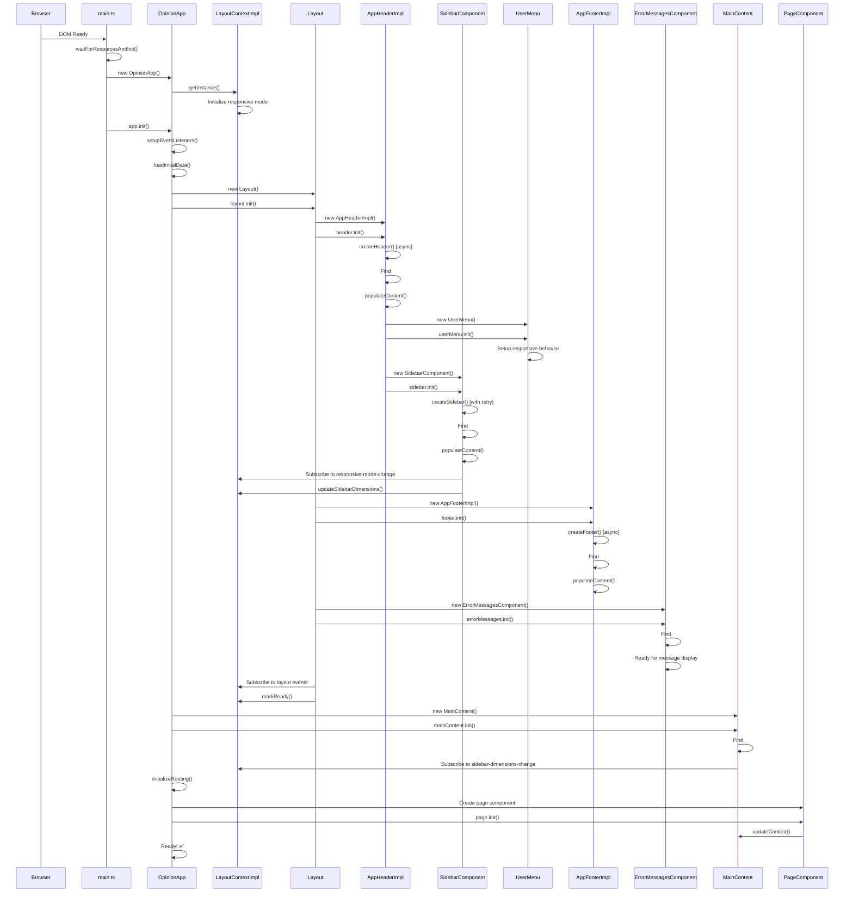
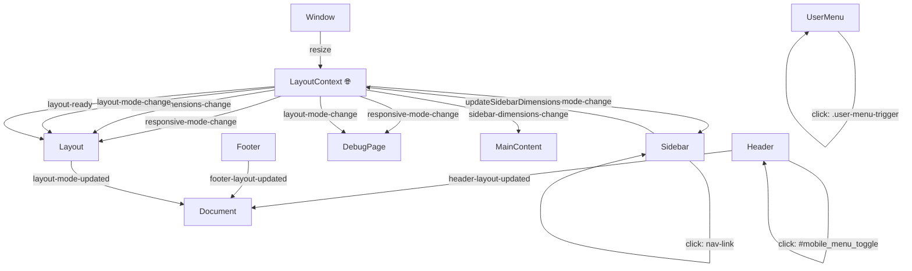

# Opinion Front UI - Architecture Documentation

## 1. Component Hierarchy & Responsibility Scope

```
OpinionApp (src/app.ts) 🎯 MAIN CONTROLLER & COMPOSITION ROOT
├── LayoutContextImpl (src/contexts/LayoutContextImpl.ts) 🏗️ MICRO-KERNEL
│   ├── EventBus (src/events/EventBusImpl.ts) 📡 EVENT COMMUNICATION
│   ├── ChainHotkeyManager (src/hotkeys/ChainHotkeyManager.ts) ⌨️ HOTKEY CHAINS
│   ├── ServiceRegistry 🏢 SERVICE MANAGEMENT
│   └── ComponentRegistry 📋 COMPONENT COORDINATION
├── MockApiService (src/services/MockApiService.ts) 📊 DATA LAYER
├── Layout (src/components/Layout.ts) 🏗️ LAYOUT COORDINATOR
│   ├── AppHeaderImpl (src/components/AppHeaderImpl.ts) 📋 TOP BAR
│   │   ├── UserMenu (src/components/UserMenu.ts) 👤 USER ACTIONS
│   │   ├── SidebarComponent (src/components/SidebarComponent.ts) 🔗 NAVIGATION
│   │   └── BreadcrumbsComponent (src/components/BreadcrumbsComponent.ts) 🍞 BREADCRUMBS
│   ├── AppFooterImpl (src/components/AppFooterImpl.ts) 📄 BOTTOM BAR
│   └── ErrorMessagesComponent (src/components/ErrorMessages.ts) 🚨 GLOBAL MESSAGES
├── MainContent (src/components/MainContent.ts) 📱 CONTENT CONTAINER
└── PageComponents 📄 DYNAMIC PAGES with PageContext
    ├── DebugPage (src/pages/DebugPage.ts) 🛠️ DEBUG TOOLS & ARCHITECTURE TESTS
    ├── DashboardPage (src/pages/DashboardPage.ts) 📊 DASHBOARD WITH MOCK DATA
    └── Future Pages 📋 EXTENSIBLE PAGE SYSTEM
        ├── Survey Management Pages
        └── User Account Pages
```

### Component Responsibilities

#### 🎯 **OpinionApp** (Main Controller)
- **Scope**: Application lifecycle management
- **Responsibilities**:
  - Initialize all core components
  - Handle routing and page transitions
  - Coordinate global application state
  - Manage error handling and recovery
- **Dependencies**: Layout, MainContent, LayoutContext, MockApiService

#### 🏗️ **LayoutContextImpl** (Micro-Kernel Application Kernel)
- **Scope**: Central application kernel managing all system resources
- **Responsibilities**:
  - **Service Registry**: Manage business logic services with dependency injection
  - **Component Registry**: Coordinate layout components (header, sidebar, footer)
  - **EventBus Management**: Provide unified event communication system
  - **Hotkey Coordination**: Chain-based hotkey management with priority resolution
  - **Responsive Layout**: Manage breakpoints, layout modes, and CSS variables
  - **Error Messaging**: Global error/warning/info/success message coordination
  - **Resource Cleanup**: Automatic cleanup of services and components
- **Pattern**: Micro-kernel architecture with service-oriented design

#### 🏗️ **Layout** (Layout Coordinator)
- **Scope**: Master page component coordination
- **Responsibilities**:
  - Initialize and coordinate Header, Footer components
  - Manage responsive layout behavior
  - Handle global CSS class management
  - Coordinate component positioning
- **Dependencies**: AppHeader, AppFooter, LayoutContext

#### 📋 **AppHeaderImpl** (Top Navigation Bar)
- **Scope**: Top application bar with navigation and user controls
- **Responsibilities**:
  - Display brand title and navigation
  - Manage mobile menu toggle
  - Host UserMenu component
  - Initialize and coordinate with SidebarComponent
- **Dependencies**: UserMenu, SidebarComponent, LayoutContextImpl

#### 🔧 **SidebarComponent** (Navigation Panel)
- **Scope**: Left navigation panel with menu items
- **Responsibilities**:
  - Render navigation menu items with icons and captions
  - Handle compact/expanded modes with toggle button
  - Manage mobile overlay behavior with slide transitions
  - Provide navigation event handling and active state management
  - Update visual active state based on NavigationService updates
- **Dependencies**: LayoutContextImpl, NavigationService

#### 👤 **UserMenu** (User Account Controls)
- **Scope**: User profile and account actions
- **Responsibilities**:
  - Display user information
  - Handle user menu interactions
  - Manage responsive display behavior
  - Provide logout/profile functionality
- **Dependencies**: None (standalone component)

#### 📱 **MainContent** (Content Container)
- **Scope**: Main content area for page components
- **Responsibilities**:
  - Manage semantic main element
  - Handle content updates from page components
  - Respond to layout context changes
  - Provide flexbox layout for page content
- **Dependencies**: LayoutContext

#### 📄 **AppFooterImpl** (Bottom Bar)
- **Scope**: Bottom application bar with links and copyright
- **Responsibilities**:
  - Display copyright and navigation links
  - Handle footer link interactions
  - Respond to layout changes
  - Manage visibility based on layout mode
- **Dependencies**: LayoutContextImpl

#### 🚨 **ErrorMessagesComponent** (Global Error Display)
- **Scope**: Global error, warning, info, and success message display
- **Responsibilities**:
  - Display various message types with appropriate styling
  - Handle message persistence and auto-hide behavior
  - Provide action buttons for interactive messages
  - Manage message lifecycle (show/hide/clear)
- **Dependencies**: None (standalone component)

#### 📡 **EventBus** (Event Communication System)
- **Scope**: Unified event communication across all application components
- **Responsibilities**:
  - **Publish/Subscribe**: Broadcast events to multiple consumers
  - **Request/Response**: Point-to-point communication with async responses
  - **Consumer Management**: Track and cleanup event subscriptions
  - **Error Handling**: Robust error boundaries for event handlers
  - **Memory Management**: Prevent memory leaks through proper cleanup
- **Pattern**: Observer pattern with TypeScript event types

#### ⌨️ **ChainHotkeyManager** (Priority-Based Hotkey System)
- **Scope**: Application-wide keyboard shortcut management with conflict resolution
- **Responsibilities**:
  - **Chain Execution**: Priority-based hotkey execution (Modal > Sidebar > Menu > Page)
  - **Provider Management**: Register and coordinate ChainHotkeyProvider components
  - **Conflict Resolution**: ESC key and other conflicts resolved through cooperative chains
  - **Dynamic Control**: Enable/disable individual hotkeys and entire providers
  - **Legacy Compatibility**: Automatic adapter for legacy registerHotkey() calls
  - **Debug Support**: Comprehensive chain execution logging and inspection
- **Pattern**: Chain of Responsibility with priority-based execution

#### 🍞 **BreadcrumbsComponent** (Hierarchical Navigation)
- **Scope**: Navigation breadcrumb display with hierarchical page management
- **Responsibilities**:
  - **Hierarchical Display**: Show current page hierarchy as clickable breadcrumbs
  - **Page-Scoped Updates**: Accept breadcrumb updates from HierarchicalBreadcrumbsManager
  - **Click Handling**: Navigate to parent pages when breadcrumb items clicked
  - **Responsive Design**: Adapt breadcrumb display for mobile and desktop
- **Dependencies**: LayoutContextImpl (for event communication)

#### 📄 **PageComponents** (Dynamic Content with PageContext)
- **Scope**: Individual page/view implementations extending PageComponent abstract class
- **Responsibilities**:
  - **Content Rendering**: Render page-specific content and handle interactions
  - **Lifecycle Management**: Implement onInit(), onDestroy() with automatic cleanup
  - **PageContext Integration**: Access hierarchical breadcrumb management and services
  - **Event Handling**: Page-level event coordination via EventBus
  - **Hotkey Registration**: Register page-specific hotkeys via ChainHotkeyProvider
  - **Service Access**: Consume registered services through LayoutContext
- **Pattern**: Template Method with lifecycle hooks and dependency injection
- **Examples**: DebugPage (architecture testing), DashboardPage (mock data integration)

---

## 2. Key Architectural Systems

### 2.1 Event-Driven Communication Architecture

The application uses a comprehensive EventBus system for component communication:

```typescript
// Publishing events (one-to-many)
layoutContext.publish('sidebar-toggled', { isCompact: true });

// Subscribing to events
layoutContext.subscribe('sidebar-toggled', (data) => {
  console.log('Sidebar state changed:', data);
});

// Request-response patterns (one-to-one)
const user = await layoutContext.request('get-current-user', {});
```

**Key Benefits:**
- **Loose Coupling**: Components don't need direct references to each other
- **Type Safety**: Full TypeScript event type definitions
- **Memory Management**: Automatic cleanup prevents memory leaks
- **Error Isolation**: Errors in one handler don't affect others

### 2.2 Chain-Based Hotkey System

Priority-based hotkey management resolves conflicts through cooperative chain execution:

```typescript
// High-priority provider (Modal Dialog)
class ModalProvider implements ChainHotkeyProvider {
  getProviderPriority(): number { return 1000; }
  
  getChainHotkeys(): Map<string, ChainHotkeyHandler> | null {
    return new Map([['Escape', {
      handler: (ctx) => {
        this.closeModal();
        ctx.break(); // Stop chain execution
      }
    }]]);
  }
}

// Lower-priority provider (Sidebar)
class SidebarProvider implements ChainHotkeyProvider {
  getProviderPriority(): number { return 800; }
  
  getChainHotkeys(): Map<string, ChainHotkeyHandler> | null {
    return new Map([['Escape', {
      handler: (ctx) => {
        this.closeSidebar();
        if (ctx.hasProvider('UserMenu')) {
          ctx.next(); // Allow UserMenu to also handle
        } else {
          ctx.break();
        }
      }
    }]]);
  }
}
```

**Chain Execution Order (ESC key):**
1. **Modal Dialog** (1000) → Executes, calls `ctx.break()` → Chain stops
2. **Mobile Sidebar** (800) → Only when modal not active
3. **User Menu** (600) → Cooperative with sidebar
4. **Page Components** (100-500) → Default handlers

### 2.3 Reactive Data Binding with Observables

Type-safe reactive data binding with automatic change notifications:

```typescript
// Basic Observable
const userName = new ObservableImpl<string>('John Doe');
userName.subscribe((newName) => console.log('User:', newName));

// ComputedObservable with dependency tracking
const fullName = new ComputedObservable<string>(
  [firstName, lastName],
  (first, last) => `${first} ${last}`
);

// Validators and Transformers
const email = new ObservableImpl<string>('')
  .withValidator((email) => email.includes('@'))
  .withTransformer((email) => email.toLowerCase().trim());
```

**Features:**
- **Dependency Tracking**: ComputedObservables automatically update when dependencies change
- **Validation**: Built-in validation with error handling
- **Transformation**: Data transformation pipelines
- **Type Safety**: Full TypeScript generic support
- **Memory Management**: Automatic cleanup of subscriptions

### 2.4 Service-Oriented Architecture

Dependency injection with service registry and interface contracts:

```typescript
// Service Interface
interface UserService {
  getCurrentUser(): Promise<User>;
  updateUser(user: User): Promise<void>;
}

// Service Implementation
class UserServiceImpl implements UserService {
  async getCurrentUser(): Promise<User> {
    return await this.apiClient.get('/user/current');
  }
}

// Service Registration (in OpinionApp)
await layoutContext.registerService('UserService', new UserServiceImpl());

// Service Consumption (in PageComponent)
const userService = await this.layoutContext.getService<UserService>('UserService');
const user = await userService.getCurrentUser();
```

**Benefits:**
- **Interface Segregation**: Services work with abstract interfaces
- **Dependency Injection**: Centralized service management
- **Testability**: Easy mocking and testing
- **Lifecycle Management**: Automatic cleanup

### 2.5 Hierarchical Breadcrumbs System

Page-scoped breadcrumb management with safe operations:

```typescript
// Page can only modify breadcrumbs at or below its level
class ReportsPage extends PageComponent {
  async onInit() {
    const pageContext = await this.getPageContext();
    const breadcrumbs = pageContext.breadcrumbs();
    
    // ✅ Safe: Only modifies scoped portion
    breadcrumbs.set([
      { id: 'ReportsPage', text: 'Reports' },     // Scope starts here
      { id: 'analytics', text: 'Analytics' },
      { id: 'dashboard', text: 'Dashboard View' }
    ]);
    
    // ❌ Ignored: Trying to modify parent scope
    breadcrumbs.remove('home'); // Silently ignored
  }
}
```

**Scoping Behavior:**
- **Parent Protection**: Breadcrumbs above current page level remain untouched
- **Safe Operations**: Operations on out-of-scope items silently ignored
- **Fallback Mode**: Append-only when page ID not found in hierarchy
- **Case-Insensitive**: Smart page scope resolution

---

## 3. Initialization Flow



### Initialization Phases

#### **Phase 1: Bootstrap** (main.ts)
1. Wait for DOM ready state
2. Check for stylesheets loaded
3. Create OpinionApp instance
4. Initialize LayoutContext singleton

#### **Phase 2: Core Layout** (Layout.ts)
1. Initialize Layout coordinator
2. Create and initialize AppHeader (async)
3. Create and initialize AppFooter (async)
4. Setup responsive behavior subscriptions
5. Mark layout as ready

#### **Phase 3: Component Tree** (AppHeader.ts)
1. Create header with retry mechanism
2. Initialize UserMenu component
3. Initialize Sidebar component
4. Setup event listeners and coordination
5. Subscribe to LayoutContext events

#### **Phase 4: Content Management** (MainContent.ts)
1. Initialize MainContent container
2. Subscribe to layout context changes
3. Setup content management system
4. Ready for page component integration

#### **Phase 5: Page Routing** (OpinionApp.ts)
1. Initialize routing system
2. Create appropriate page component
3. Inject page content into MainContent
4. Setup page-specific behavior

---

## 3. Event System & Communication Map



### Event Categories

#### 🌐 **LayoutContext Events** (Global State Changes)

| Event Name | Emitter | Listeners | Data | Purpose |
|------------|---------|-----------|------|---------|
| `responsive-mode-change` | LayoutContext | Sidebar, Layout, DebugPage | `{type, isMobile, isTablet, isDesktop, viewport, breakpoints}` | Notify components of viewport changes |
| `sidebar-dimensions-change` | LayoutContext | Layout, MainContent | `{width, rightBorder, isCompact, isMobile, isVisible}` | Update layout based on sidebar changes |
| `layout-mode-change` | LayoutContext | Layout, DebugPage | `{type, isCompact, isMobile, isTablet, isDesktop}` | Handle layout mode transitions |
| `layout-ready` | LayoutContext | Layout | `{sidebar, viewport}` | Signal complete initialization |

#### 🖱️ **DOM Events** (User Interactions)

| Event Target | Event Type | Handler | Purpose |
|--------------|------------|---------|---------|
| `.compact-toggle-btn` | `click` | Sidebar | Toggle sidebar compact mode |
| `.mobile-close-btn` | `click` | Sidebar | Close mobile sidebar overlay |
| `.nav-link` | `click` | Sidebar | Navigate to different pages |
| `#mobile_menu_toggle` | `click` | AppHeader | Open mobile sidebar |
| `.user-menu-trigger` | `click` | UserMenu | Toggle user menu dropdown |
| `window` | `resize` | LayoutContext | Update responsive mode |

#### 📡 **Custom Events** (Component Communication)

| Event Name | Emitter | Target | Data | Purpose |
|------------|---------|--------|------|---------|
| `header-layout-updated` | AppHeader | Document | `{dimensions, headerElement}` | Notify of header layout changes |
| `footer-layout-updated` | AppFooter | Document | `{dimensions, footerElement}` | Notify of footer layout changes |
| `layout-mode-updated` | Layout | Document | `{layoutMode, components}` | Broadcast layout mode changes |

### Communication Patterns

#### **1. Centralized State Management**
- LayoutContext acts as single source of truth
- Components subscribe to relevant state changes
- Unidirectional data flow from LayoutContext to components

#### **2. Event-Driven Architecture**
- Loose coupling between components
- Pub/Sub pattern for cross-component communication
- Components can react to changes without direct dependencies

#### **3. Hierarchical Command Flow**
- Parent components initialize and manage child components
- Commands flow down the hierarchy
- Events bubble up through the event system

#### **4. Responsive Coordination**
- LayoutContext monitors viewport changes
- Automatically updates all subscribed components
- Ensures consistent responsive behavior across the application

---

## Key Architectural Benefits

### 🔄 **Reactive Architecture**
- Components automatically update when dependencies change
- No manual coordination needed between layout components
- Responsive behavior happens automatically

### 🧩 **Modular Design**
- Each component has clear, focused responsibilities
- Components can be developed and tested independently
- Easy to extend with new components or pages

### 🎯 **Centralized State**
- Single source of truth for layout state
- Consistent behavior across all components
- Easy to debug and reason about

### 🔧 **Robust Initialization**
- Async initialization with retry mechanisms
- Graceful error handling and recovery
- Components can initialize independently

### 📱 **Mobile-First Responsive**
- Comprehensive responsive breakpoint system
- Mobile overlay patterns for navigation
- Automatic adaptation to different screen sizes

This architecture provides a solid foundation for a scalable, maintainable frontend application with clean separation of concerns and robust state management.
