# Opinion Front UI - Architecture Documentation

## 1. Component Hierarchy & Responsibility Scope

```
OpinionApp (src/app.ts) 🎯 MAIN CONTROLLER
├── LayoutContextImpl (src/contexts/LayoutContextImpl.ts) 🌐 GLOBAL STATE
├── MockApiService (src/services/MockApiService.ts) 📊 DATA LAYER
├── Layout (src/components/Layout.ts) 🏗️ LAYOUT COORDINATOR
│   ├── AppHeaderImpl (src/components/AppHeaderImpl.ts) 📋 TOP BAR
│   │   ├── UserMenu (src/components/UserMenu.ts) 👤 USER ACTIONS
│   │   └── SidebarComponent (src/components/SidebarComponent.ts) 🔗 NAVIGATION
│   ├── AppFooterImpl (src/components/AppFooterImpl.ts) 📄 BOTTOM BAR
│   └── ErrorMessagesComponent (src/components/ErrorMessages.ts) 🚨 GLOBAL MESSAGES
├── MainContent (src/components/MainContent.ts) 📱 CONTENT CONTAINER
└── PageComponents 📄 DYNAMIC PAGES
    ├── DebugPage (src/pages/DebugPage.ts) 🛠️ DEBUG TOOLS
    └── DashboardPage (src/pages/DashboardPage.ts) 📊 DASHBOARD
```

### Component Responsibilities

#### 🎯 **OpinionApp** (Main Controller)
- **Scope**: Application lifecycle management
- **Responsibilities**:
  - Initialize all core components
  - Handle routing and page transitions
  - Coordinate global application state
  - Manage error handling and recovery
- **Dependencies**: Layout, MainContent, LayoutContext, MockApiService

#### 🌐 **LayoutContextImpl** (Global State Manager)
- **Scope**: Cross-component communication and state management
- **Responsibilities**:
  - Manage responsive breakpoints and layout modes
  - Track sidebar dimensions and states
  - Provide event system for component coordination
  - Handle global error messages and notifications
  - Maintain layout state consistency
- **Pattern**: Singleton with event emitter

#### 🏗️ **Layout** (Layout Coordinator)
- **Scope**: Master page component coordination
- **Responsibilities**:
  - Initialize and coordinate Header, Footer components
  - Manage responsive layout behavior
  - Handle global CSS class management
  - Coordinate component positioning
- **Dependencies**: AppHeader, AppFooter, LayoutContext

#### 📋 **AppHeaderImpl** (Top Navigation Bar)
- **Scope**: Top application bar with navigation and user controls
- **Responsibilities**:
  - Display brand title and navigation
  - Manage mobile menu toggle
  - Host UserMenu component
  - Initialize and coordinate with SidebarComponent
- **Dependencies**: UserMenu, SidebarComponent, LayoutContextImpl

#### 🔧 **SidebarComponent** (Navigation Panel)
- **Scope**: Left navigation panel with menu items
- **Responsibilities**:
  - Render navigation menu items with icons and captions
  - Handle compact/expanded modes with toggle button
  - Manage mobile overlay behavior with slide transitions
  - Provide navigation event handling and active state management
- **Dependencies**: LayoutContextImpl

#### 👤 **UserMenu** (User Account Controls)
- **Scope**: User profile and account actions
- **Responsibilities**:
  - Display user information
  - Handle user menu interactions
  - Manage responsive display behavior
  - Provide logout/profile functionality
- **Dependencies**: None (standalone component)

#### 📱 **MainContent** (Content Container)
- **Scope**: Main content area for page components
- **Responsibilities**:
  - Manage semantic main element
  - Handle content updates from page components
  - Respond to layout context changes
  - Provide flexbox layout for page content
- **Dependencies**: LayoutContext

#### 📄 **AppFooterImpl** (Bottom Bar)
- **Scope**: Bottom application bar with links and copyright
- **Responsibilities**:
  - Display copyright and navigation links
  - Handle footer link interactions
  - Respond to layout changes
  - Manage visibility based on layout mode
- **Dependencies**: LayoutContextImpl

#### 🚨 **ErrorMessagesComponent** (Global Error Display)
- **Scope**: Global error, warning, info, and success message display
- **Responsibilities**:
  - Display various message types with appropriate styling
  - Handle message persistence and auto-hide behavior
  - Provide action buttons for interactive messages
  - Manage message lifecycle (show/hide/clear)
- **Dependencies**: None (standalone component)

#### 📄 **PageComponents** (Dynamic Content)
- **Scope**: Individual page/view implementations
- **Responsibilities**:
  - Render page-specific content
  - Handle page-specific interactions
  - Integrate with MainContent for display
  - Manage page lifecycle
- **Example**: DebugPage

---

## 2. Initialization Flow


### Initialization Phases

#### **Phase 1: Bootstrap** (main.ts)
1. Wait for DOM ready state
2. Check for stylesheets loaded
3. Create OpinionApp instance
4. Initialize LayoutContext singleton

#### **Phase 2: Core Layout** (Layout.ts)
1. Initialize Layout coordinator
2. Create and initialize AppHeader (async)
3. Create and initialize AppFooter (async)
4. Setup responsive behavior subscriptions
5. Mark layout as ready

#### **Phase 3: Component Tree** (AppHeader.ts)
1. Create header with retry mechanism
2. Initialize UserMenu component
3. Initialize Sidebar component
4. Setup event listeners and coordination
5. Subscribe to LayoutContext events

#### **Phase 4: Content Management** (MainContent.ts)
1. Initialize MainContent container
2. Subscribe to layout context changes
3. Setup content management system
4. Ready for page component integration

#### **Phase 5: Page Routing** (OpinionApp.ts)
1. Initialize routing system
2. Create appropriate page component
3. Inject page content into MainContent
4. Setup page-specific behavior

---

## 3. Event System & Communication Map

```mermaid
graph TD
    LC[LayoutContext 🌐]
    
    %% Event Sources
    LC --> |responsive-mode-change| Sidebar
    LC --> |responsive-mode-change| Layout
    LC --> |responsive-mode-change| DebugPage
    
    LC --> |sidebar-dimensions-change| Layout
    LC --> |sidebar-dimensions-change| MainContent
    
    LC --> |layout-mode-change| Layout
    LC --> |layout-mode-change| DebugPage
    
    LC --> |layout-ready| Layout
    
    %% Event Emitters
    Sidebar --> |updateSidebarDimensions| LC
    Window --> |resize| LC
    
    %% DOM Events
    Sidebar --> |click: .compact-toggle-btn| Sidebar
    Sidebar --> |click: .mobile-close-btn| Sidebar
    Sidebar --> |click: nav-link| Sidebar
    
    Header --> |click: #mobile_menu_toggle| Header
    UserMenu --> |click: .user-menu-trigger| UserMenu
    
    %% Custom Events
    Header --> |header-layout-updated| Document
    Footer --> |footer-layout-updated| Document
    Layout --> |layout-mode-updated| Document
```



### Event Categories

#### 🌐 **LayoutContext Events** (Global State Changes)

| Event Name | Emitter | Listeners | Data | Purpose |
|------------|---------|-----------|------|---------|
| `responsive-mode-change` | LayoutContext | Sidebar, Layout, DebugPage | `{type, isMobile, isTablet, isDesktop, viewport, breakpoints}` | Notify components of viewport changes |
| `sidebar-dimensions-change` | LayoutContext | Layout, MainContent | `{width, rightBorder, isCompact, isMobile, isVisible}` | Update layout based on sidebar changes |
| `layout-mode-change` | LayoutContext | Layout, DebugPage | `{type, isCompact, isMobile, isTablet, isDesktop}` | Handle layout mode transitions |
| `layout-ready` | LayoutContext | Layout | `{sidebar, viewport}` | Signal complete initialization |

#### 🖱️ **DOM Events** (User Interactions)

| Event Target | Event Type | Handler | Purpose |
|--------------|------------|---------|---------|
| `.compact-toggle-btn` | `click` | Sidebar | Toggle sidebar compact mode |
| `.mobile-close-btn` | `click` | Sidebar | Close mobile sidebar overlay |
| `.nav-link` | `click` | Sidebar | Navigate to different pages |
| `#mobile_menu_toggle` | `click` | AppHeader | Open mobile sidebar |
| `.user-menu-trigger` | `click` | UserMenu | Toggle user menu dropdown |
| `window` | `resize` | LayoutContext | Update responsive mode |

#### 📡 **Custom Events** (Component Communication)

| Event Name | Emitter | Target | Data | Purpose |
|------------|---------|--------|------|---------|
| `header-layout-updated` | AppHeader | Document | `{dimensions, headerElement}` | Notify of header layout changes |
| `footer-layout-updated` | AppFooter | Document | `{dimensions, footerElement}` | Notify of footer layout changes |
| `layout-mode-updated` | Layout | Document | `{layoutMode, components}` | Broadcast layout mode changes |

### Communication Patterns

#### **1. Centralized State Management**
- LayoutContext acts as single source of truth
- Components subscribe to relevant state changes
- Unidirectional data flow from LayoutContext to components

#### **2. Event-Driven Architecture**
- Loose coupling between components
- Pub/Sub pattern for cross-component communication
- Components can react to changes without direct dependencies

#### **3. Hierarchical Command Flow**
- Parent components initialize and manage child components
- Commands flow down the hierarchy
- Events bubble up through the event system

#### **4. Responsive Coordination**
- LayoutContext monitors viewport changes
- Automatically updates all subscribed components
- Ensures consistent responsive behavior across the application

---

## Key Architectural Benefits

### 🔄 **Reactive Architecture**
- Components automatically update when dependencies change
- No manual coordination needed between layout components
- Responsive behavior happens automatically

### 🧩 **Modular Design**
- Each component has clear, focused responsibilities
- Components can be developed and tested independently
- Easy to extend with new components or pages

### 🎯 **Centralized State**
- Single source of truth for layout state
- Consistent behavior across all components
- Easy to debug and reason about

### 🔧 **Robust Initialization**
- Async initialization with retry mechanisms
- Graceful error handling and recovery
- Components can initialize independently

### 📱 **Mobile-First Responsive**
- Comprehensive responsive breakpoint system
- Mobile overlay patterns for navigation
- Automatic adaptation to different screen sizes

This architecture provides a solid foundation for a scalable, maintainable frontend application with clean separation of concerns and robust state management.
