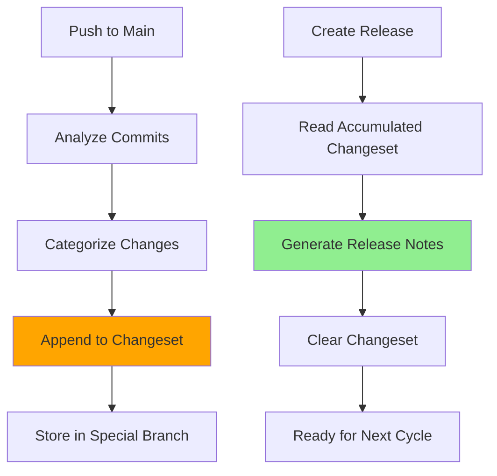

# 📝 Changeset Accumulator System

This document describes the **Changeset Accumulator System** that automatically tracks changes for release notes.

## 🎯 **How It Works**



## 📋 **What Gets Tracked**

Every push to main automatically analyzes commits and categorizes them:

### **🏷️ Conventional Commits Support**
- `feat:` → 🚀 **Features**
- `fix:` → 🐛 **Bug Fixes**  
- `docs:` → 📚 **Documentation**
- `style:` → 💄 **Styling**
- `refactor:` → ♻️ **Refactoring**
- `perf:` → ⚡ **Performance**
- `test:` → 🧪 **Testing**
- `chore:` → 🔧 **Maintenance**
- `ci:` → 👷 **CI/CD**
- Other → 📦 **Changes**

### **🚨 Breaking Changes Detection**
- `feat!:` or `fix!:` → Marked as ⚠️ **BREAKING**
- `BREAKING CHANGE:` in commit body → Detected automatically

## 🔍 **Example Changeset Accumulation**

### **After Multiple Pushes:**
```markdown
# 📋 Pending Release Changelog

## 📊 Summary
- **Total Commits**: 15
- **Last Updated**: 2024-01-15 by developer-name

---

## 📝 Changes by Category

---
**Push on 2024-01-12 by john-doe**

### 🚀 Features
- feat: add user authentication system ([a1b2c3d](link)) - _john-doe_
- feat: implement OAuth integration ([b2c3d4e](link)) - _john-doe_

### 🐛 Bug Fixes  
- fix: resolve login validation issue ([c3d4e5f](link)) - _john-doe_

---
**Push on 2024-01-15 by jane-smith**

### 🧪 Testing
- test: add authentication unit tests ([d4e5f6g](link)) - _jane-smith_
- test: improve test coverage ([e5f6g7h](link)) - _jane-smith_

### 🔧 Maintenance
- chore: update dependencies ([f6g7h8i](link)) - _jane-smith_
```

## 🚀 **Release Integration**

### **When You Create a Release:**

1. **📖 Reads Changeset**: Release workflow finds accumulated changes
2. **📝 Generates Notes**: Uses categorized changes for release notes
3. **🧹 Clears Changeset**: Resets for next release cycle

### **Example Release Notes:**
```markdown
## 🚀 Release v1.2.0

2024-01-15 18:30:00 UTC

## 📝 Changes by Category

### 🚀 Features
- feat: add user authentication system ([a1b2c3d](link)) - _john-doe_
- feat: implement OAuth integration ([b2c3d4e](link)) - _john-doe_

### 🐛 Bug Fixes
- fix: resolve login validation issue ([c3d4e5f](link)) - _john-doe_

### 🧪 Testing
- test: add authentication unit tests ([d4e5f6g](link)) - _jane-smith_
- test: improve test coverage ([e5f6g7h](link)) - _jane-smith_

---

## 📊 Release Information
- **Version**: v1.2.0
- **Previous Version**: v1.1.0  
- **Release Date**: 2024-01-15
- **Build Configuration**: Production

## 📦 Assets
- **Build artifacts**: Available in the release assets
- **Source code**: Available as zip and tar.gz
```

## 🔧 **Technical Details**

### **Storage Location**
- **Branch**: `changeset-accumulator` (orphan branch)
- **File**: `PENDING_CHANGELOG.md`
- **Access**: [View Current Changeset](../../blob/changeset-accumulator/PENDING_CHANGELOG.md)

### **Workflow Files**
- **Accumulator**: `.github/workflows/changeset-accumulator.yml`
- **Consumer**: `.github/workflows/release.yml` (updated)

### **Automatic Actions**
| Trigger | Action | Result |
|---------|--------|--------|
| Push to main | Analyze commits → Append changeset | Updated pending changelog |
| Create release | Read changeset → Generate notes → Clear changeset | Release with rich notes |

## 💡 **Benefits**

- ✅ **Automatic**: No manual changelog maintenance
- ✅ **Categorized**: Changes grouped by type
- ✅ **Rich Context**: Commit links, authors, dates
- ✅ **Breaking Changes**: Automatically flagged  
- ✅ **Conventional Commits**: Supports standard format
- ✅ **Clean Releases**: Changeset cleared after each release

## 🔍 **Monitoring Changeset**

### **View Current Pending Changes**
- **Direct Link**: [Pending Changeset](../../blob/changeset-accumulator/PENDING_CHANGELOG.md)
- **Branch View**: Switch to `changeset-accumulator` branch

### **After Each Push**
Check the workflow summary for:
- Number of commits analyzed
- Categories detected
- Link to updated changeset

### **Release Verification**  
Release summary shows:
- ✅ Used accumulated changeset
- 📋 Used git log fallback (if no changeset)

## 🎯 **Best Practices**

### **For Better Changesets**
1. **Use Conventional Commits**: `feat:`, `fix:`, `docs:`, etc.
2. **Descriptive Messages**: Clear, concise commit messages
3. **Breaking Changes**: Use `!` or `BREAKING CHANGE:` when needed
4. **Atomic Commits**: One logical change per commit

### **Example Good Commits**
```bash
feat: add user profile management
fix: resolve memory leak in data loader  
docs: update API documentation
perf: optimize database queries
feat!: change authentication API (BREAKING)
```

This system ensures your releases always have **comprehensive, well-organized release notes** without any manual effort! 🚀