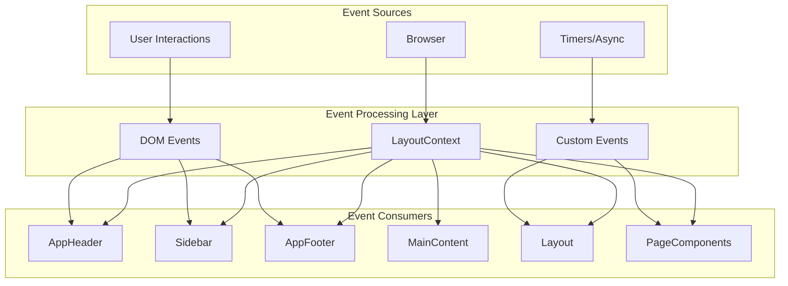
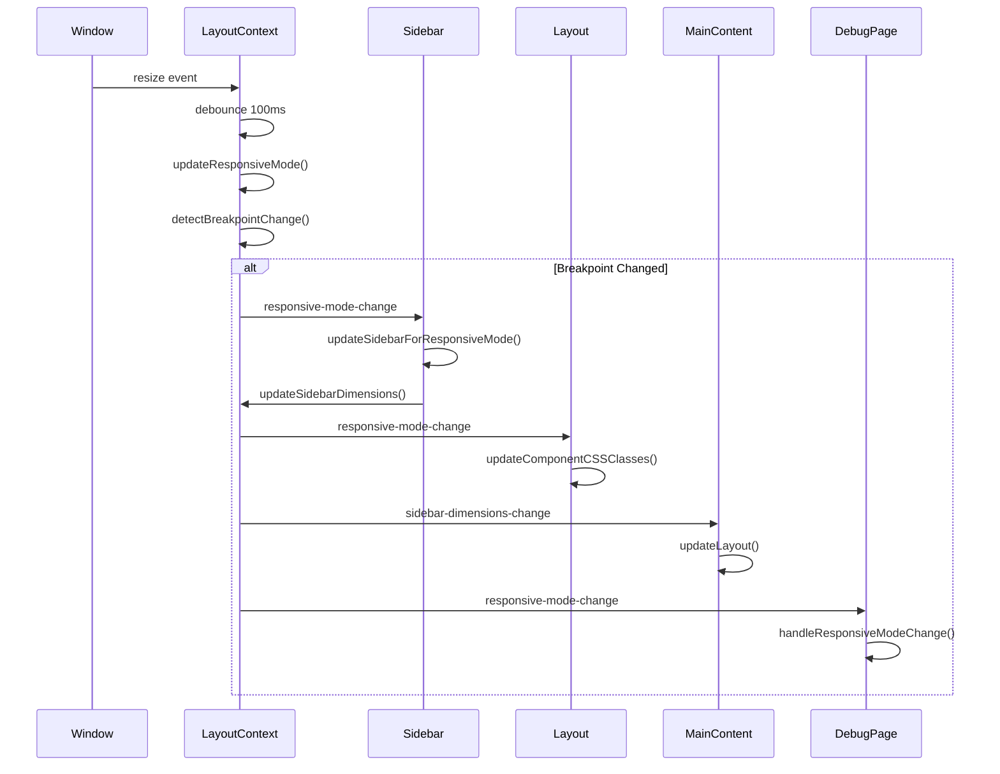
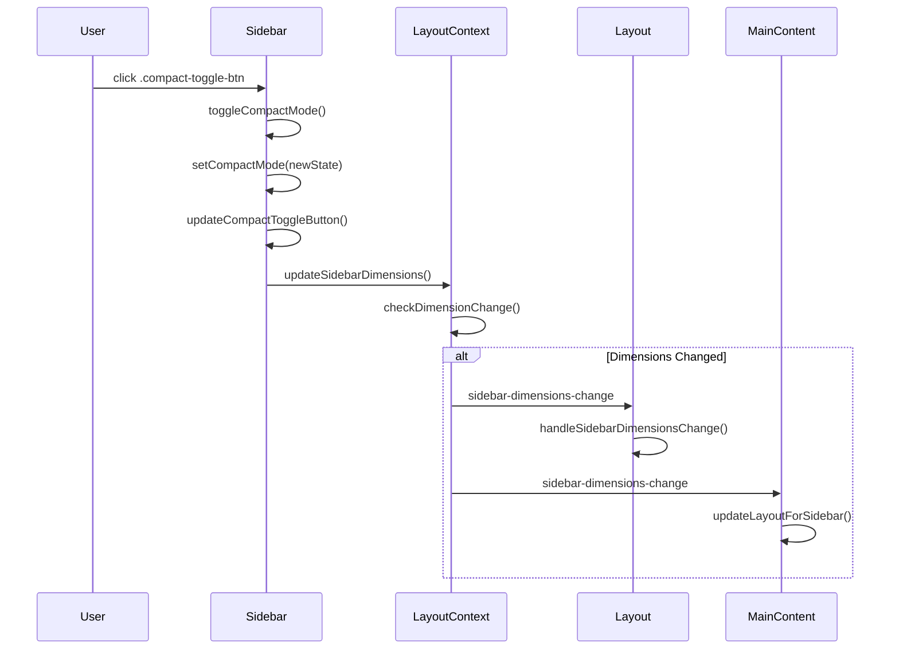
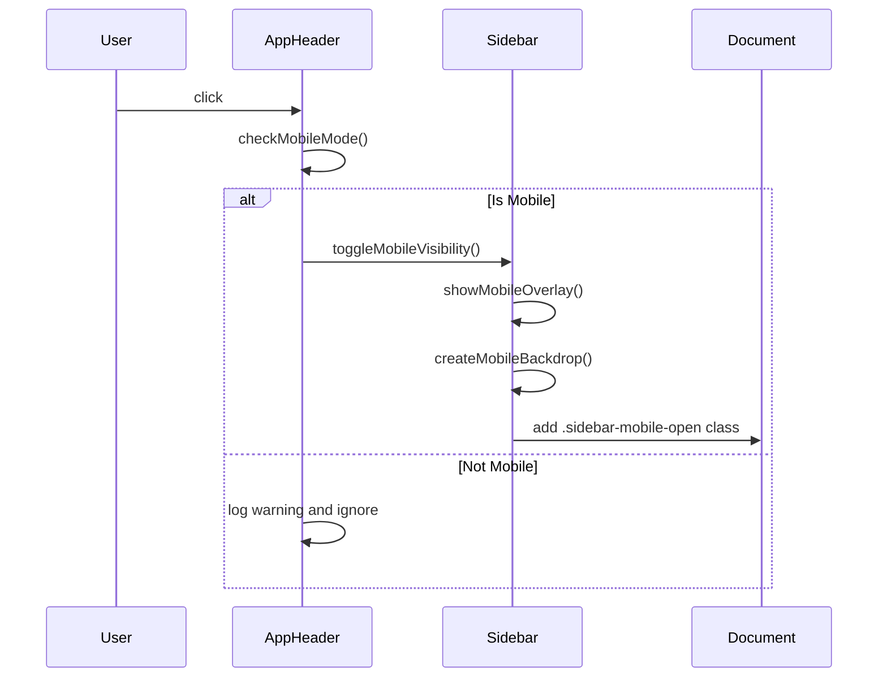

# Event System Documentation

## Overview

The Opinion Front UI uses a sophisticated event-driven architecture that enables loose coupling between components while maintaining consistent state management. The system combines centralized state management through LayoutContext with DOM event handling and custom event dispatching.

## 1. Event Handling Policy

### Event Scope Rules

1. **DOM Event Scope**
   - Components MUST ONLY handle events from elements within their own DOM scope
   - Example: Button click handlers should only be attached to buttons within the component's container

2. **Global Event Prohibition**
   - Components MUST NOT directly subscribe to:
     - Window events (resize, scroll, etc.)
     - Document-level events
     - Custom events outside their DOM scope
   - All global state changes must come through LayoutContext events

3. **Exception Process**
   - Any need for global event handling MUST be discussed and documented
   - Common exceptions that require discussion:
     - Keyboard shortcuts/hotkeys
     - Viewport changes
     - Browser history/navigation
     - Storage events

4. **Approved Global Handlers**
   - LayoutContext: Centralized handler for viewport/responsive changes
   - HotkeyManager: Global keyboard shortcut management
   - These services emit proper layout events that components can consume

### Event Emission Rules

1. **Component Events**
   - Components MUST use CustomEvent for component-specific events
   - Event detail MUST include the source component ID
   - Events MUST bubble only within the component's container
   ```typescript
   // ✅ CORRECT: Scoped custom event
   this.container.dispatchEvent(new CustomEvent('item-selected', {
     bubbles: true,
     composed: false,
     detail: {
       componentId: this.id,
       selectedItem: item
     }
   }));
   ```

2. **Global State Changes**
   - Components MUST NOT emit global custom events
   - State changes affecting multiple components MUST go through LayoutContext:
   ```typescript
   // ❌ INCORRECT: Global custom event
   document.dispatchEvent(new CustomEvent('theme-changed'));
   
   // ✅ CORRECT: Use LayoutContext
   layoutContext.emit('theme-mode-change', { mode: 'dark' });
   ```

3. **Event Naming**
   - Component events: `${componentId}-${action}` (e.g., 'sidebar-item-selected')
   - LayoutContext events: `${scope}-${type}-${action}` (e.g., 'layout-mode-change')

### Component Event Guidelines

```typescript
// ❌ INCORRECT: Direct window event subscription
class BadComponent {
  constructor() {
    window.addEventListener('resize', () => this.handleResize());
  }
}

// ✅ CORRECT: React to LayoutContext events
class GoodComponent {
  constructor(layoutContext: LayoutContext) {
    layoutContext.subscribe('layout-mode-change', 
      (event) => this.updateLayout(event.data)
    );
  }
}
```

## 2. Event System Architecture



## 2. LayoutContext Events (Central State Management)

### Event Registration System

```typescript
// Subscription pattern
private listeners: { [eventType: string]: Array<(event: LayoutEvent) => void> } = {};

subscribe(eventType: string, callback: (event: LayoutEvent) => void): () => void {
    if (!this.listeners[eventType]) {
        this.listeners[eventType] = [];
    }
    this.listeners[eventType].push(callback);
    
    // Return unsubscribe function
    return () => {
        const index = this.listeners[eventType].indexOf(callback);
        if (index > -1) {
            this.listeners[eventType].splice(index, 1);
        }
    };
}
```

### Core LayoutContext Events

#### 1. `responsive-mode-change`
**Emitter:** LayoutContext  
**Trigger:** Window resize, viewport changes  
**Frequency:** Debounced (100ms)  
**Data:**
```typescript
{
    type: 'mobile' | 'tablet' | 'desktop' | 'desktop-compact',
    isMobile: boolean,
    isTablet: boolean, 
    isDesktop: boolean,
    viewport: {
        width: number,
        height: number
    },
    breakpoints: {
        mobile: number,    // 768
        tablet: number,    // 1024
        desktop: number    // 1025+
    },
    sidebarBehavior: {
        isVisible: boolean,
        canToggle: boolean,
        defaultWidth: number,
        compactWidth: number
    }
}
```

**Subscribers:**
- **Sidebar**: Updates visibility, dimensions, and behavior
- **Layout**: Updates global CSS classes and coordination
- **DebugPage**: Updates debug information display
- **Other PageComponents**: Adapt content layout

#### 2. `sidebar-dimensions-change`
**Emitter:** LayoutContext (triggered by Sidebar)  
**Trigger:** Sidebar compact toggle, visibility changes  
**Frequency:** Immediate  
**Data:**
```typescript
{
    width: number,           // Current sidebar width
    rightBorder: number,     // Right edge position
    isCompact: boolean,      // Compact mode state
    isMobile: boolean,       // Mobile mode flag
    isVisible: boolean       // Visibility state
}
```

**Subscribers:**
- **Layout**: Updates global layout coordination
- **MainContent**: Adjusts content area positioning
- **Other components**: Respond to layout changes

#### 3. `layout-mode-change`
**Emitter:** LayoutContext  
**Trigger:** Responsive mode changes, sidebar state changes  
**Frequency:** When mode actually changes  
**Data:**
```typescript
{
    type: 'mobile' | 'tablet' | 'desktop' | 'desktop-compact',
    isCompact: boolean,
    isMobile: boolean,
    isTablet: boolean,
    isDesktop: boolean,
    viewport: ViewportState,
    sidebar: SidebarDimensions
}
```

**Subscribers:**
- **Layout**: Updates component CSS classes
- **DebugPage**: Updates layout mode indicators
- **PageComponents**: Adapt to layout mode

#### 4. `layout-ready`
**Emitter:** LayoutContext  
**Trigger:** Layout.markReady() called  
**Frequency:** Once per session  
**Data:**
```typescript
{
    sidebar: SidebarDimensions,
    viewport: ViewportState
}
```

**Subscribers:**
- **Layout**: Finalizes component coordination
- **Components**: Perform final initialization

## 3. DOM Events (User Interactions)

### Sidebar Events

#### Navigation Menu Interactions
```typescript
// Event delegation pattern
this.sidebar.addEventListener('click', (event) => {
    const target = event.target as HTMLElement;
    
    // Navigation link clicks
    const navLink = target.closest('a[href]') as HTMLAnchorElement;
    if (navLink && navLink.href.startsWith(window.location.origin)) {
        console.log('Navigation clicked:', navLink.href);
        this.setActiveItem(navLink.getAttribute('data-nav-id') || '');
        // Router will handle actual navigation
    }
});
```

#### Compact Mode Toggle
```typescript
// Compact toggle button
this.sidebar.addEventListener('click', (event) => {
    const target = event.target as HTMLElement;
    const toggleButton = target.closest('.compact-toggle-btn') as HTMLButtonElement;
    
    if (toggleButton) {
        event.preventDefault();
        event.stopPropagation();
        
        // Check if locked
        if (this.isLocked() && !this.compactMode) {
            console.log('Toggle blocked: sidebar locked');
            return;
        }
        
        this.toggleCompactMode(); // Triggers LayoutContext events
    }
});
```

#### Mobile Overlay Controls
```typescript
// Mobile close button
this.sidebar.addEventListener('click', (event) => {
    const target = event.target as HTMLElement;
    const closeButton = target.closest('.mobile-close-btn') as HTMLButtonElement;
    
    if (closeButton) {
        event.preventDefault();
        event.stopPropagation();
        this.toggleMobileVisibility();
    }
});
```

### AppHeader Events

#### Mobile Menu Toggle
```typescript
// Mobile hamburger menu
const mobileMenuToggle = document.getElementById('mobile_menu_toggle');
mobileMenuToggle?.addEventListener('click', (e) => {
    e.preventDefault();
    e.stopPropagation();
    
    const isMobile = window.innerWidth <= 768;
    if (!isMobile) {
        console.log('Not in mobile mode, ignoring');
        return;
    }
    
    // Trigger sidebar mobile toggle
    this.sidebar?.toggleMobileVisibility();
});
```

### UserMenu Events

#### Dropdown Toggle
```typescript
// User menu dropdown
this.trigger?.addEventListener('click', (e) => {
    e.preventDefault();
    e.stopPropagation();
    this.toggleDropdown();
});

// Outside click to close
document.addEventListener('click', (e) => {
    if (!this.container?.contains(e.target as Node)) {
        this.closeDropdown();
    }
});
```

### Window Events

#### Responsive Breakpoint Detection
```typescript
// Window resize handling (debounced)
private resizeTimeout: number | null = null;

private handleWindowResize(): void {
    if (this.resizeTimeout) {
        clearTimeout(this.resizeTimeout);
    }
    
    this.resizeTimeout = setTimeout(() => {
        this.updateResponsiveMode();
        this.emitEvent('responsive-mode-change', this.getResponsiveMode());
    }, 100); // 100ms debounce
}

window.addEventListener('resize', () => this.handleWindowResize());
```

## 4. Custom Events (Component Communication)

### Component Layout Updates

#### Header Layout Changes
```typescript
// AppHeader dispatches when layout updates
const event = new CustomEvent('header-layout-updated', {
    detail: {
        dimensions: SidebarDimensions,
        headerElement: HTMLElement
    }
});
document.dispatchEvent(event);
```

#### Footer Layout Changes
```typescript
// AppFooter dispatches layout updates
const event = new CustomEvent('footer-layout-updated', {
    detail: {
        dimensions: SidebarDimensions,
        footerElement: HTMLElement
    }
});
document.dispatchEvent(event);
```

#### Global Layout Mode Updates
```typescript
// Layout component dispatches mode changes
const event = new CustomEvent('layout-mode-updated', {
    detail: {
        layoutMode: LayoutMode,
        components: ComponentElementMap
    }
});
document.dispatchEvent(event);
```

## 5. Event Flow Examples

### Responsive Breakpoint Change Flow



### Sidebar Compact Toggle Flow



### Mobile Menu Toggle Flow



## 6. Event Performance & Memory Management

### Event Subscription Cleanup

```typescript
// Component cleanup pattern
destroy(): void {
    // Unsubscribe from LayoutContext events
    this.layoutUnsubscribers.forEach(unsubscribe => {
        try {
            unsubscribe();
        } catch (error) {
            console.error('Error unsubscribing:', error);
        }
    });
    this.layoutUnsubscribers = [];
    
    // Remove DOM event listeners
    // (automatically cleaned up when elements are removed)
}
```

### Event Debouncing

```typescript
// Resize event debouncing in LayoutContext
private resizeTimeout: number | null = null;

private handleWindowResize(): void {
    if (this.resizeTimeout) {
        clearTimeout(this.resizeTimeout);
    }
    
    this.resizeTimeout = setTimeout(() => {
        this.updateResponsiveMode();
    }, 100); // Debounce resize events
}
```

### Subscription Management

```typescript
// LayoutContext subscription tracking
private listeners: { [eventType: string]: Array<(event: LayoutEvent) => void> } = {};

subscribe(eventType: string, callback: (event: LayoutEvent) => void): () => void {
    // Track subscription
    if (!this.listeners[eventType]) {
        this.listeners[eventType] = [];
    }
    this.listeners[eventType].push(callback);
    
    console.log(`Subscribed to ${eventType} (${this.listeners[eventType].length} total listeners)`);
    
    // Return cleanup function
    return () => {
        const index = this.listeners[eventType].indexOf(callback);
        if (index > -1) {
            this.listeners[eventType].splice(index, 1);
        }
    };
}
```

## 7. Event Debugging

### Event Logging

```typescript
// LayoutContext event emission logging
private emitEvent(eventType: string, data: any): void {
    const listeners = this.listeners[eventType] || [];
    console.log(`Emitting ${eventType} to ${listeners.length} listeners:`, data);
    
    listeners.forEach((callback, index) => {
        try {
            callback({ type: eventType, data, timestamp: Date.now() });
        } catch (error) {
            console.error(`Error in ${eventType} listener ${index}:`, error);
        }
    });
}
```

### Component Event Status

```typescript
// DebugPage shows event subscription status
getEventSystemStatus(): string {
    const layoutContext = LayoutContext.getInstance();
    return `
        📡 Event System Status:
        - responsive-mode-change: ${this.responsiveUnsubscribers.length} subscriptions
        - sidebar-dimensions-change: Active
        - layout-mode-change: Active
        - DOM Events: ${this.domEventHandlers.length} handlers
    `;
}
```

This event system provides a robust, scalable foundation for component communication while maintaining performance and proper memory management.
