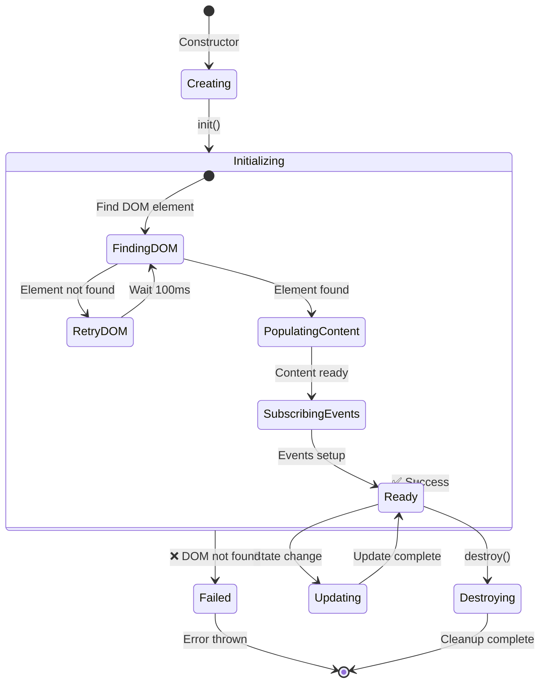

# Component Hierarchy Visual Diagrams

## 1. Complete Component Tree

```
📦 Opinion Front UI Application
│
├── 🎯 OpinionApp (MAIN CONTROLLER)
│   ├── 🌐 LayoutContext (SINGLETON STATE)
│   ├── 📊 MockApiService (DATA LAYER)
│   │
│   ├── 🏗️ Layout (LAYOUT COORDINATOR)
│   │   ├── 📋 AppHeader (TOP BAR)
│   │   │   ├── 🔗 Sidebar (NAVIGATION)
│   │   │   │   ├── Navigation Items
│   │   │   │   │   ├── 📊 Dashboard
│   │   │   │   │   ├── 📋 Surveys  
│   │   │   │   │   └── 🛠️ Debug
│   │   │   │   ├── Compact Toggle Button
│   │   │   │   └── Mobile Close Button
│   │   │   │
│   │   │   ├── 👤 UserMenu (USER ACTIONS)
│   │   │   │   ├── User Display
│   │   │   │   ├── Dropdown Menu
│   │   │   │   └── Logout Action
│   │   │   │
│   │   │   ├── Mobile Menu Toggle
│   │   │   └── Breadcrumb Navigation
│   │   │
│   │   └── 📄 AppFooter (BOTTOM BAR)
│   │       ├── Navigation Links
│   │       │   └── 🐛 Report Bug
│   │       └── Copyright Text
│   │
│   ├── 📱 MainContent (CONTENT CONTAINER)
│   │   ├── Semantic <main> Element
│   │   ├── Content Update System
│   │   └── Layout Response Handler
│   │
│   └── 📄 Page Components (DYNAMIC CONTENT)
│       └── 🛠️ DebugPage (CURRENT PAGE)
│           ├── Debug Information
│           ├── Layout Tests
│           └── Component Status
```

## 2. DOM Structure Mapping

```html
<div class="app-layout">                    <!-- CSS Grid Container -->
  
  <nav id="app-sidebar" class="app-sidebar"> <!-- 🔗 Sidebar Component -->
    <div class="sidebar-header">
      <div class="sidebar-brand">...</div>    <!-- Brand Title -->
      <div class="sidebar-controls">
        <button class="compact-toggle-btn">   <!-- Compact Toggle -->
        <button class="mobile-close-btn">     <!-- Mobile Close -->
      </div>
    </div>
    <div class="sidebar-navigation">         <!-- Navigation Menu -->
      <ul class="nav-list">...</ul>
    </div>
    <div class="sidebar-footer">             <!-- Footer Content -->
      <p class="copyright-text">...</p>
    </div>
  </nav>
  
  <div class="app-content-scroll">           <!-- Scrollable Content Area -->
    
    <header id="app-header" class="app-header"> <!-- 📋 AppHeader Component -->
      <div class="header-container">
        <div class="header-left">
          <button id="mobile_menu_toggle">    <!-- Mobile Toggle -->
        </div>
        <div class="header-center">           <!-- Breadcrumbs -->
          <nav class="header-breadcrumbs">...</nav>
        </div>
        <div class="header-right">            <!-- 👤 UserMenu -->
          <div id="user_menu_container">...</div>
        </div>
      </div>
    </header>
    
    <main id="app-main" class="app-main">    <!-- 📱 MainContent Component -->
      <!-- 📄 Page Components render here -->
    </main>
    
    <footer id="app-footer" class="app-footer"> <!-- 📄 AppFooter Component -->
      <div class="footer-container">
        <div class="footer-content">
          <nav class="footer-navigation">...</nav>
          <div class="footer-copyright-section">...</div>
        </div>
      </div>
    </footer>
    
  </div>
</div>
```

## 3. Component Responsibility Matrix

| Component | DOM Target | CSS Classes | Event Handling | State Management | Responsive |
|-----------|------------|-------------|----------------|------------------|------------|
| **OpinionApp** | Document | Body classes | Global errors | App lifecycle | Coordinates |
| **LayoutContext** | CSS Variables | Layout modes | Window resize | Global state | **PRIMARY** |
| **Layout** | .app-layout | Mode classes | Layout events | Component coord | Subscribes |
| **AppHeader** | #app-header | Header states | Mobile toggle | User info | Subscribes |
| **Sidebar** | #app-sidebar | Compact modes | Navigation | Menu state | **ACTIVE** |
| **UserMenu** | #user_menu_container | Dropdown states | User actions | User data | **SELF** |
| **MainContent** | #app-main | Content layout | Content updates | Page content | Subscribes |
| **AppFooter** | #app-footer | Footer layout | Link navigation | Footer links | Subscribes |
| **PageComponents** | MainContent | Page-specific | Page actions | Page data | Subscribes |

## 4. Data Flow Directions

```
┌─────────────────┐
│   Browser       │
│   - Viewport    │ ───┐
│   - User Input  │    │
└─────────────────┘    │
                       ▼
┌─────────────────┐  ┌─────────────────┐
│  DOM Events     │  │  LayoutContext  │ ◄─── Window Resize
│  - Click        │  │  - Responsive   │
│  - Touch        │  │  - Breakpoints  │
│  - Keyboard     │  │  - State        │
└─────────────────┘  └─────────────────┘
         │                     │
         ▼                     │ Events
┌─────────────────┐           │
│  Components     │ ◄─────────┘
│  - Sidebar      │
│  - Header       │   
│  - Footer       │   ┌─────────────────┐
│  - MainContent  │   │  Page Component │
│  - UserMenu     │ ◄─┤  - DebugPage    │
└─────────────────┘   │  - Dashboard    │
         │             │  - Survey       │
         ▼             └─────────────────┘
┌─────────────────┐
│   DOM Updates   │
│   - CSS Classes │
│   - Content     │
│   - Visibility  │
└─────────────────┘
```

## 5. Component Lifecycle States



This visual documentation complements the main architecture overview and provides clear visual understanding of how components interact and flow within the Opinion Front UI application.
