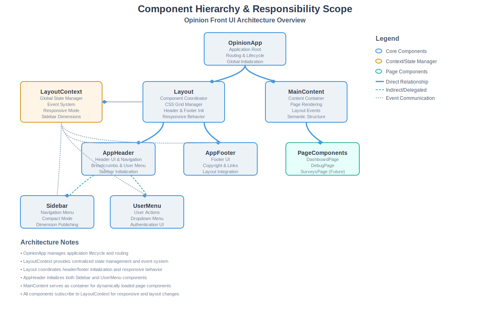
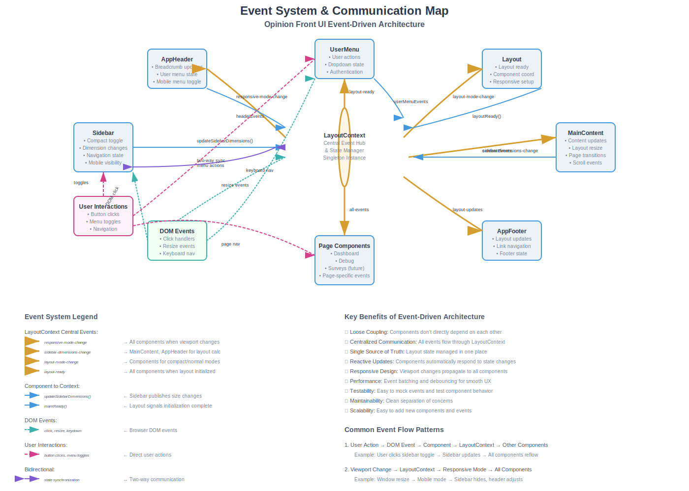

# Opinion Front UI - Architectural Diagrams

This directory contains visual diagrams that illustrate the Opinion Front UI architecture and complement the existing documentation. These diagrams provide a high-level overview of the component relationships, initialization flow, and event-driven communication patterns.

## Available Diagrams

### 1. Component Hierarchy & Responsibility Scope
**File:** `component-hierarchy.svg`

This diagram shows:
- **OpinionApp** at the root managing application lifecycle and routing
- **LayoutContext** as the central state manager and event hub
- **Layout** coordinating header/footer initialization and responsive behavior
- **AppHeader** managing both Sidebar and UserMenu components
- **MainContent** serving as the container for dynamically loaded page components
- Clear separation between core components, context/state managers, and page components

**Key Relationships:**
- Direct relationships (solid blue lines): Direct instantiation and management
- Indirect/delegated relationships (dashed teal lines): Initialization delegation
- Event communication (dotted gray lines): Event system subscriptions

### 2. Initialization Flow Sequence Diagram
**File:** `initialization-flow.svg`

This sequence diagram illustrates the complete startup process:

**Phase 1: DOM Ready & Application Bootstrap**
1. Browser triggers DOMContentLoaded
2. main.ts creates OpinionApp instance
3. OpinionApp.init() begins async initialization

**Phase 2: Layout Context & Global Layout Initialization**
4. LayoutContext singleton instance obtained
5. Layout component created and initialized
6. Layout sets up responsive behavior

**Phase 3: Header & Sidebar Initialization**
7. AppHeader created and initialized by Layout
8. AppHeader creates and initializes Sidebar (async)
9. AppHeader creates and initializes UserMenu (async)
10. Sidebar publishes initial dimensions to LayoutContext

**Phase 4: Footer & MainContent Initialization**
11. AppFooter created and initialized
12. Layout marks itself as ready in LayoutContext

**Phase 5: MainContent & Page Component Loading**
13. MainContent created and subscribes to layout events
14. Routing initialized and initial page component loaded

**Key Features:**
- All `init()` methods are async and properly awaited
- Clean initialization order ensures dependencies are met
- LayoutContext manages all component communication
- Event system enables loose coupling between components

### 3. Event System & Communication Map
**File:** `event-system-communication.svg`

This diagram maps the event-driven architecture:

**Central LayoutContext Hub:**
- Acts as the central event hub and state manager
- Singleton instance coordinating all component communication
- Manages responsive mode, layout state, and sidebar dimensions

**Event Flow Types:**
- **Context Emissions** (thick orange lines): LayoutContext broadcasting to components
  - `responsive-mode-change`: Viewport mode transitions
  - `sidebar-dimensions-change`: Sidebar size updates
  - `layout-mode-change`: Compact/normal mode changes
  - `layout-ready`: Initialization completion signal

- **Component Emissions** (blue lines): Components reporting to LayoutContext
  - `updateSidebarDimensions()`: Sidebar publishing size changes
  - `markReady()`: Layout signaling completion
  - Component-specific state updates

- **DOM Events** (dashed teal lines): Browser event handling
  - Click handlers, resize events, keyboard navigation
  - Event delegation and bubbling patterns

- **User Interactions** (dashed pink lines): Direct user actions
  - Button clicks, menu toggles, navigation actions
  - User-initiated state changes

**Key Benefits:**
- 🔗 **Loose Coupling**: Components don't directly depend on each other
- 📡 **Centralized Communication**: All events flow through LayoutContext
- 🎯 **Single Source of Truth**: Layout state managed in one place
- 🔄 **Reactive Updates**: Components automatically respond to state changes
- 📱 **Responsive Design**: Viewport changes propagate to all components
- ⚡ **Performance**: Event batching and debouncing for smooth UX

## How These Diagrams Complement Existing Documentation

### Integration with Code Documentation
These diagrams work alongside the existing documentation to provide:

1. **Visual Architecture Overview**: While code comments explain implementation details, these diagrams show the big picture of how components interact.

2. **Initialization Understanding**: The sequence diagram clarifies the async initialization order that's implemented in the code but may not be immediately obvious from reading individual files.

3. **Event System Clarity**: The communication map makes the event-driven architecture visible, showing how the LayoutContext serves as the central nervous system of the application.

### Relationship to Existing Docs
- **`src/docs/`**: Technical implementation details and examples
- **Component `.ts` files**: Individual component responsibilities and interfaces
- **These diagrams**: System-level architecture and component interactions

### For New Developers
These diagrams provide new team members with:
- Quick understanding of the overall architecture
- Clear view of component responsibilities and boundaries
- Visual guide to the initialization process
- Understanding of the event-driven communication patterns

### For Architects and Senior Developers
The diagrams help with:
- System design decisions and trade-offs
- Planning new features and integrations
- Code reviews and architecture discussions
- Documentation of architectural decisions

## Updating the Diagrams

These SVG diagrams are hand-crafted and should be updated when:
- New components are added to the system
- Component relationships change significantly
- New event types are introduced
- The initialization flow is modified

To update the diagrams:
1. Edit the SVG files directly (they contain embedded styling and are self-contained)
2. Test the visual output in a browser or SVG viewer
3. Update this README if new diagrams are added or existing ones are significantly changed

## Viewing the Diagrams

The SVG files can be viewed:
- **In GitHub**: Directly in the repository browser
- **In VS Code**: With SVG preview extensions
- **In browsers**: By opening the files directly
- **In documentation**: Referenced from markdown files using relative paths

The diagrams are designed to be scalable and readable at different zoom levels, with clear legends and comprehensive labeling.
