# Initialization Flow - Detailed Documentation

## Overview

The Opinion Front UI follows a carefully orchestrated initialization sequence that ensures proper component dependencies, DOM availability, and responsive layout setup. This document details the complete flow from browser load to fully functional application.

## 1. Initialization Sequence Timeline

```
🌐 Browser Load
│
├── 0ms    📄 HTML Parsed
├── 50ms   🎨 CSS Loading
├── 100ms  📜 JavaScript Loading  
├── 150ms  🔧 DOM Ready Event
├── 200ms  🚀 main.ts Execution
│
└── Application Initialization Begins
    │
    ├── Phase 1: Bootstrap (200-250ms)
    │   ├── DOM Ready Check
    │   ├── Stylesheet Load Wait
    │   └── OpinionApp Creation
    │
    ├── Phase 2: Core Services (250-300ms) 
    │   ├── LayoutContext Singleton
    │   ├── MockApiService Setup
    │   └── Event System Initialize
    │
    ├── Phase 3: Layout Coordination (300-400ms)
    │   ├── Layout Component Creation
    │   ├── AppHeader Initialization (async)
    │   └── AppFooter Initialization (async)
    │
    ├── Phase 4: Navigation Setup (350-450ms)
    │   ├── Sidebar Component (with retry)
    │   ├── UserMenu Component
    │   └── Responsive Subscriptions
    │
    ├── Phase 5: Content Management (400-500ms)
    │   ├── MainContent Initialization
    │   ├── Layout Context Ready
    │   └── Component Coordination
    │
    └── Phase 6: Page Loading (450-550ms)
        ├── Route Processing
        ├── Page Component Creation
        ├── Content Injection
        └── ✅ Application Ready
```

## 2. Detailed Phase Breakdown

### Phase 1: Bootstrap (main.ts)

```typescript
// Entry point execution flow
if (document.readyState === 'loading') {
    // DOM still loading - wait for DOMContentLoaded
    document.addEventListener('DOMContentLoaded', waitForResourcesAndInit);
} else if (document.readyState === 'interactive') {
    // DOM ready but resources still loading
    waitForResourcesAndInit();
} else {
    // Everything loaded - start immediately
    initApp();
}

function waitForResourcesAndInit() {
    if (document.readyState !== 'complete') {
        // Wait for all resources (CSS, images, etc.)
        window.addEventListener('load', () => {
            setTimeout(initApp, 50); // Give layout time to stabilize
        });
    } else {
        setTimeout(initApp, 10); // Small delay for safety
    }
}
```

**Key Actions:**
- ✅ Check DOM ready state
- ✅ Wait for stylesheets to load (prevent FOUC)
- ✅ Create OpinionApp instance
- ✅ Handle different loading states gracefully

### Phase 2: Core Services (app.ts - init())

```typescript
async init(): Promise<void> {
    // 1. Setup global error handling
    this.setupEventListeners();
    
    // 2. Load initial data
    await this.loadInitialData();
    
    // 3. Initialize layout system
    await this.initializeGlobalLayout();
    
    // 4. Setup routing
    this.initializeRouting();
}
```

**Key Actions:**
- ✅ Global error handlers setup
- ✅ LayoutContext singleton initialized
- ✅ Responsive mode detection
- ✅ MockApiService created

### Phase 3: Layout Coordination (Layout.ts)

```typescript
async init(): Promise<void> {
    // 1. Initialize AppHeader (includes Sidebar)
    if (this.config.header?.enabled) {
        await this.header.init(); // Async with retry
    }
    
    // 2. Initialize AppFooter
    if (this.config.footer?.enabled) {
        await this.footer.init(); // Async with retry
    }
    
    // 3. Setup component coordination
    this.setupComponentCoordination();
    
    // 4. Subscribe to responsive events
    this.setupResponsiveBehavior();
    
    // 5. Mark layout as ready
    this.layoutContext.markReady();
}
```

**Key Actions:**
- ✅ Sequential component initialization
- ✅ Async DOM element finding with retry
- ✅ Responsive behavior setup
- ✅ Layout context events subscription

### Phase 4: Navigation Setup (AppHeader.ts)

```typescript
async init(): Promise<void> {
    // 1. Create header DOM structure
    await this.createHeader(); // With retry mechanism
    
    // 2. Initialize UserMenu
    await this.initUserMenu();
    
    // 3. Initialize Sidebar (graceful failure)
    try {
        await this.initSidebar();
    } catch (sidebarError) {
        console.warn('Sidebar failed, continuing...', sidebarError);
        this.sidebar = null;
    }
    
    // 4. Setup event listeners
    this.setupEventListeners();
}
```

**Key Actions:**
- ✅ DOM element retry mechanism (100ms timeout)
- ✅ Component content population
- ✅ Event handler setup
- ✅ Graceful component failure handling

### Phase 5: Content Management (MainContent.ts)

```typescript
init(): void {
    // 1. Find and setup main content element
    this.findMainElement();
    
    // 2. Subscribe to layout changes
    this.subscribeToLayoutContext();
    
    // 3. Setup content management system
    this.setupContentManagement();
    
    // 4. Ready for page components
    console.log('MainContent - Ready ✅');
}
```

**Key Actions:**
- ✅ Semantic main element management
- ✅ Layout context subscriptions
- ✅ Content update system ready
- ✅ Page component integration ready

### Phase 6: Page Loading (OpinionApp.ts - routing)

```typescript
private initializeRouting(): void {
    const currentPath = window.location.pathname;
    this.handleRoute(currentPath);
}

private async handleRoute(path: string): Promise<void> {
    // Create appropriate page component
    let pageComponent = this.createPageComponent(path);
    
    // Initialize page component
    await pageComponent.init();
    
    // Application ready!
    console.log('✅ APP.TS - Opinion Front UI - Ready');
}
```

## 3. Error Handling & Recovery

### DOM Element Retry Mechanism

```typescript
// Pattern used in AppHeader, AppFooter, Sidebar
private async createComponent(): Promise<void> {
    this.element = document.getElementById('component-id');
    
    if (!this.element) {
        // Retry after 100ms
        return new Promise((resolve, reject) => {
            setTimeout(() => {
                this.element = document.getElementById('component-id');
                if (!this.element) {
                    console.error('Element not found:', 
                        Array.from(document.querySelectorAll('[id]')).map(el => el.id));
                    reject(new Error('Component element not found'));
                    return;
                }
                this.finalizeCreation();
                resolve();
            }, 100);
        });
    }
    
    this.finalizeCreation();
}
```

### Graceful Component Failure

```typescript
// Example from AppHeader initialization
try {
    await this.initSidebar();
} catch (sidebarError) {
    console.warn('Sidebar initialization failed, continuing without sidebar:', sidebarError);
    this.sidebar = null; // Graceful degradation
}
```

## 4. State Synchronization Points

### Critical Synchronization Events

1. **DOM Ready** → JavaScript can safely run
2. **LayoutContext Ready** → Components can subscribe to events  
3. **Layout Marked Ready** → All layout components initialized
4. **Sidebar Dimensions Published** → Layout adjustments can occur
5. **MainContent Ready** → Page components can be loaded
6. **Page Component Loaded** → Application fully functional

### Event Coordination Timeline

```mermaid
gantt
    title Component Initialization Timeline
    dateFormat X
    axisFormat %L
    
    section Bootstrap
    DOM Ready Check      :0, 50
    Stylesheet Wait      :25, 75
    OpinionApp Created   :50, 100
    
    section Core Services  
    LayoutContext Init   :75, 125
    MockApiService       :100, 125
    Event System         :100, 150
    
    section Layout
    Layout Init          :125, 175
    AppHeader Init       :150, 225
    AppFooter Init       :150, 200
    
    section Navigation
    Sidebar Init         :175, 250
    UserMenu Init        :200, 225
    Event Handlers       :225, 275
    
    section Content
    MainContent Init     :200, 250
    Context Subscribe    :225, 275
    Layout Ready         :250, 275
    
    section Page Load
    Route Processing     :275, 325
    Page Component       :300, 350
    Content Injection    :325, 375
    App Ready           :350, 375
```



## 5. Performance Considerations

### Async Initialization Benefits
- ✅ Non-blocking component loading
- ✅ Graceful handling of timing issues  
- ✅ Better error recovery
- ✅ Smoother user experience

### Resource Loading Strategy
- 🎨 CSS loaded inline to prevent FOUC
- 📜 JavaScript modules loaded asynchronously
- 🔄 Components initialize in dependency order
- ⚡ Critical path optimized for fast startup

### Memory Management
- 🧹 Event listeners properly attached/detached
- 🔄 Component cleanup on destroy
- 📊 State subscriptions managed centrally
- 🎯 No memory leaks in initialization flow

This initialization flow ensures robust, predictable application startup with excellent error handling and performance characteristics.
